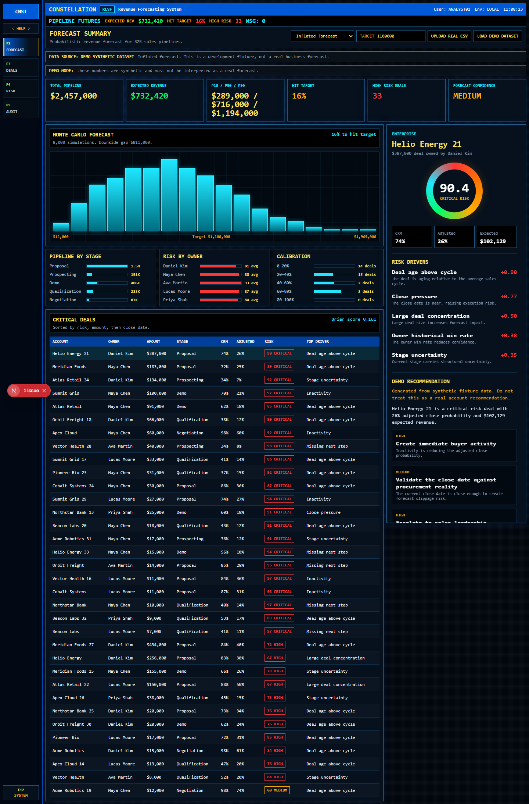
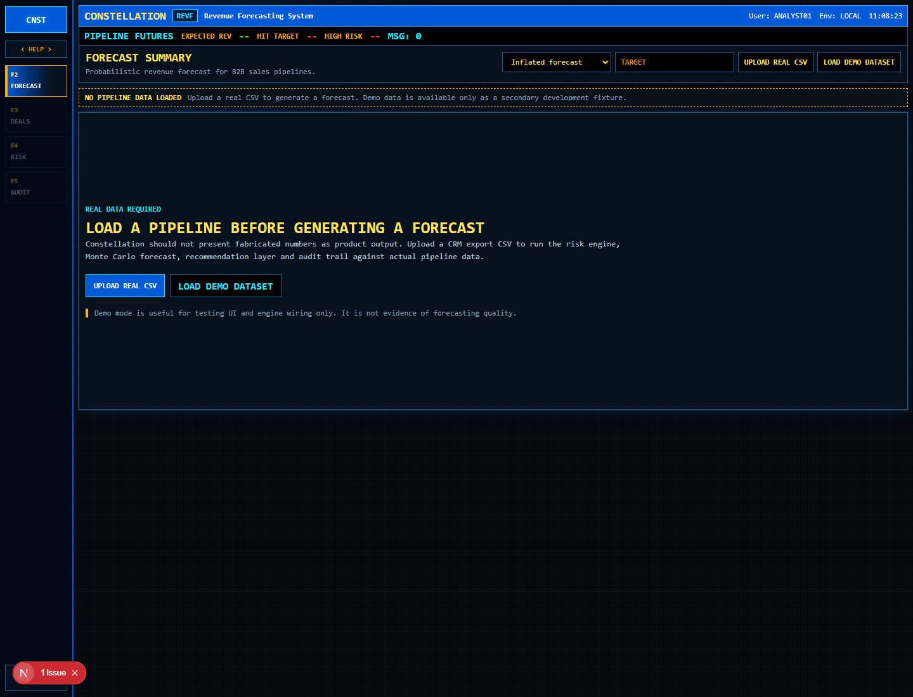
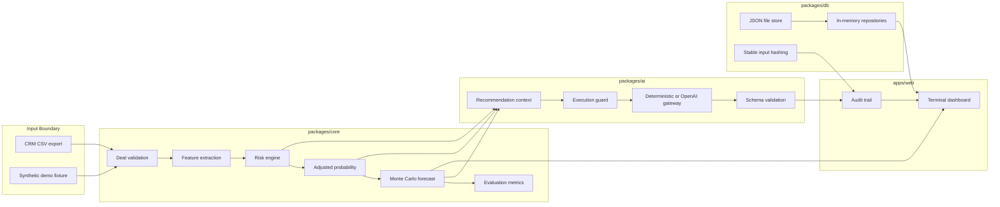
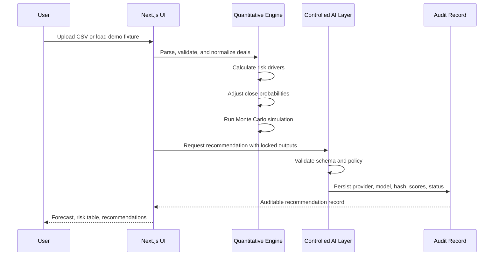

# Constellation

AI-native revenue forecasting for B2B sales pipelines under uncertainty.

Constellation converts pipeline exports into deal-level risk, adjusted close
probability, Monte Carlo forecast ranges, controlled AI recommendations, and an
auditable decision record. It is not a CRM, a generic dashboard, or a sales
chatbot.

> The LLM does not decide. The deterministic forecasting engine decides. The AI
> layer explains and recommends from validated system outputs.



## Contents

- [Product Overview](#product-overview)
- [Screenshots](#screenshots)
- [Architecture](#architecture)
- [Forecasting Model](#forecasting-model)
- [AI Control Layer](#ai-control-layer)
- [Data Contract](#data-contract)
- [Project Structure](#project-structure)
- [Getting Started](#getting-started)
- [Configuration](#configuration)
- [Verification](#verification)
- [Current Status](#current-status)
- [Roadmap](#roadmap)

## Product Overview

Sales pipeline forecasts are often driven by stale CRM probabilities, manual
manager overrides, and optimistic stage assumptions. Constellation keeps the
forecasting path explicit and reviewable:

1. ingest a CRM pipeline export through CSV;
2. validate and normalize every deal into a domain contract;
3. compute deterministic risk drivers and adjusted close probability;
4. simulate revenue outcomes with Monte Carlo;
5. generate recommendation text from locked numerical outputs;
6. preserve audit metadata for review.

The current implementation is a local product foundation. It supports real CSV
input, deterministic demo fixtures, quantitative tests, a local repository
layer, and a terminal-style web dashboard.

## Screenshots

### Empty State And CSV Entry

The default screen does not show fabricated revenue numbers. A forecast is
created only after a CSV upload or an explicit demo dataset selection.



### Forecast Dashboard

Demo datasets are visually marked as synthetic fixtures. They are useful for
UI development and engine verification, not for proving forecast quality.


## Architecture



### Runtime Flow



## Forecasting Model

Constellation forecasts revenue with deterministic quantitative logic before
any AI-generated explanation is produced.

Deal-level expected revenue:

```txt
ER_i = Amount_i * P_adjusted_i
```

Pipeline expected revenue:

```txt
ER_pipeline = sum(ER_i)
```

Base probability is blended in logit space from CRM probability, stage prior,
owner historical win rate, and source prior:

```txt
baseLogit =
  w_crm * logit(P_crm) +
  w_stage * logit(P_stage) +
  w_owner * logit(P_owner) +
  w_source * logit(P_source)
```

Risk pressure is then applied to the base probability:

```txt
P_adjusted = sigmoid(baseLogit - gamma * risk)
```

Monte Carlo simulation samples each deal as a Bernoulli variable:

```txt
Revenue_s = sum(Amount_i * Bernoulli(P_adjusted_i))
```

The simulated revenue distribution is used to compute expected revenue,
standard deviation, percentiles, downside gap, upside potential, forecast
confidence, and probability of hitting the target.

## AI Control Layer

The AI layer is optional and controlled by policy. It cannot overwrite:

- risk score;
- risk level;
- risk drivers;
- base probability;
- adjusted probability;
- expected revenue;
- forecast percentiles;
- input hash;
- risk engine version.

Default behavior uses the deterministic gateway:

```env
AI_PROVIDER=deterministic
```

When OpenAI credentials are configured server-side, the recommendation service
can run in one of two modes:

```env
AI_PIPELINE_MODE=single
```

Single-step mode generates one structured recommendation.

```env
AI_PIPELINE_MODE=two_step
```

Two-step mode separates structured assessment from executive reporting.

Guardrails include schema validation, per-request call budgets, deterministic
fallback, timeout controls, prompt versioning, usage metadata, latency metadata,
and audit status tracking.

## Data Contract

Supported CSV columns:

```csv
id,accountName,ownerName,segment,amount,stage,createdAt,closeDate,stageEnteredAt,lastActivityAt,nextStep,crmProbability,ownerHistoricalWinRate,averageSalesCycleDays,source
```

Accepted values:

| Field | Values |
| --- | --- |
| `segment` | `smb`, `mid_market`, `enterprise` |
| `stage` | `prospecting`, `qualification`, `demo`, `proposal`, `negotiation`, `closed_won`, `closed_lost` |
| `source` | `inbound`, `outbound`, `partner`, `referral` |
| probabilities | decimals such as `0.6` or percentages such as `60%` |

Minimal example:

```csv
id,accountName,ownerName,segment,amount,stage,createdAt,closeDate,stageEnteredAt,lastActivityAt,nextStep,crmProbability,ownerHistoricalWinRate,averageSalesCycleDays,source
deal-1,Acme Corp,Maya Chen,mid_market,80000,proposal,2026-04-12,2026-07-25,2026-06-14,2026-06-27,Review proposal,60%,0.48,70,inbound
```

## Project Structure

```txt
apps/web
  Next.js terminal-style product interface.

packages/core
  Domain model, validation, CSV importer, risk engine, probability engine,
  Monte Carlo forecast, confidence scoring, and evaluation metrics.

packages/ai
  Prompt policy, schemas, deterministic fallback, optional OpenAI gateway,
  execution guard, recommendation service, and audit record generation.

packages/db
  Repository contracts, in-memory repositories, JSON file persistence, stable
  input hashing, and seed support.

packages/synthetic-data
  Seeded development fixtures and synthetic scenario generation.

docs
  Architecture notes, algorithm documentation, phase plans, and UI direction.
```

## Getting Started

Install dependencies:

```bash
npm install
```

Start the web app:

```bash
npm run dev
```

Open:

```txt
http://localhost:3000
```

If port `3000` is already in use:

```bash
npm --workspace @constellation/web run dev -- -p 3001
```

Seed local demo data:

```bash
npm run seed
```

## Configuration

Create a local environment file:

```bash
copy .env.example .env.local
```

Keep `.env.local` out of Git.

Common variables:

```env
AI_PROVIDER=deterministic
AI_PIPELINE_MODE=single
AI_MAX_CALLS_PER_REQUEST=1
OPENAI_API_KEY=
OPENAI_MODEL=gpt-4.1-mini
AI_ANALYSIS_MODEL=gpt-4.1-mini
AI_REPORT_MODEL=gpt-4.1
OPENAI_BASE_URL=
OPENAI_MAX_OUTPUT_TOKENS=700
AI_ANALYSIS_MAX_OUTPUT_TOKENS=700
AI_REPORT_MAX_OUTPUT_TOKENS=1800
OPENAI_TEMPERATURE=0.2
OPENAI_TIMEOUT_MS=15000
AI_RECOMMENDATION_TONE=executive
AI_RECOMMENDATION_DETAIL_LEVEL=standard
AI_RECOMMENDATION_MAX_ACTIONS=4
AI_PROMPT_VERSION=deal-recommendation-v0.3.0
```

Use `AI_PROVIDER=openai` only when external model calls are intentional. API
keys should remain server-side.

## Verification

Run the test suite:

```bash
npm test
```

Run TypeScript validation:

```bash
npx tsc --noEmit
```

Run a production build:

```bash
npm run build
```

## Current Status

Implemented:

- validated B2B deal domain contracts;
- deterministic risk scoring and driver attribution;
- adjusted close probability;
- Monte Carlo revenue forecasting;
- forecast confidence and evaluation metrics;
- CSV pipeline import;
- local JSON and in-memory repositories;
- stable input hashing;
- deterministic recommendation fallback;
- optional OpenAI gateway;
- single-step and two-step AI orchestration;
- audit metadata generation;
- terminal-style web dashboard;
- unit tests across core, data, synthetic, and AI packages.

Not implemented yet:

- Salesforce or HubSpot live sync;
- authentication;
- multi-tenancy;
- billing;
- production database migrations;
- background jobs;
- autonomous agents;
- vector database or RAG;
- Slack or email alerts;
- workflow builders.

These should be added only after the real-data ingestion path and audit surface
are validated against representative pipeline exports.

## Roadmap

Near-term priorities:

1. move forecast and recommendation execution behind server-side routes;
2. persist audit records from the web workflow;
3. add CSV import error reporting in the UI;
4. add representative real-export fixtures;
5. introduce authentication and tenant boundaries;
6. replace JSON persistence with a production database adapter;
7. add CRM sync after the CSV workflow is proven.

## Documentation

- [Architecture](docs/architecture.md)
- [Algorithms](docs/algorithms.md)
- [Phase 1: Domain and Contracts](docs/phase-1-domain-contracts.md)
- [Phase 2: Quantitative Engine](docs/phase-2-quantitative-engine.md)
- [Phase 3: Data and Audit](docs/phase-3-data-audit.md)
- [Phase 4: Controlled AI Layer](docs/phase-4-controlled-ai-layer.md)
- [Frontend Terminal Design](docs/frontend-terminal-design.md)
